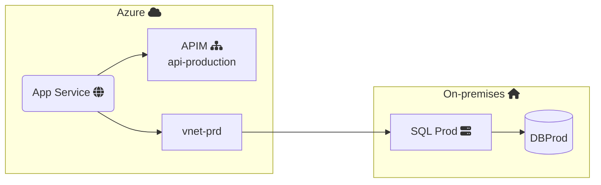

Add a file `_scripts.cshtml`

<?# IncludeCode "./../_scripts.cshtml" /?>

## [Devlead]

- [scripts](https://github.com/devlead/Devlead.Statiq/blob/main/src/Devlead.Statiq.TestWeb/input/_scripts.cshtml)
- [Tabs.md](https://github.com/devlead/Devlead.Statiq/blob/main/src/Devlead.Statiq.TestWeb/input/posts/Tabs.md)

## Other

- [Using Mermaid diagrams with Statiq.](https://www.dpvreony.com/articles/mermaid-with-statiq/)
  - [repo](https://github.com/dpvreony/article-statiq-mermaid)
- [Mermaid Diagrams in Statiq](https://blog.beckshome.com/2022/09/mermaid-in-statiq)
  - [code](https://github.com/thbst16/dotnet-statiq-beckshome-blog/blob/main/input/posts/mermaid-in-statiq.md)

- [StatiqMermaid Repo](https://github.com/ociaw/StatiqMermaid)
  - [nuget](https://www.nuget.org/packages/Ociaw.StatiqMermaid/0.1.0-beta.2)
